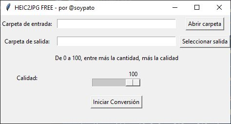

# HEIC2JPG FREE

Un programa simple que convierte archivos HEIC a JPG de forma gratuita, permitiendo ajustar la calidad y las carpetas de entrada y salida.

## Interfaz gráfica



## Características

- Convierte archivos HEIC a JPG.
- Permite ajustar la calidad de la conversión.
- Selección de carpetas de entrada y salida.
- Interfaz gráfica de usuario (GUI) simple y fácil de usar.

## Requisitos

- Python 3.x
- `tkinter` (incluido con la mayoría de las distribuciones de Python)
- `heic2png` (instalar utilizando pip)

## Instalación

1. Clona este repositorio:
    ```sh
    git clone https://github.com/soypato/heic2jpg.git
    cd heic2jpg
    ```

2. Instala las dependencias necesarias:
    ```sh
    pip install heic2png
    ```

## Uso

1. Ejecuta el script principal:
    ```sh
    python heic2jpg.py
    ```

2. Usa la interfaz gráfica para seleccionar la carpeta de entrada que contiene los archivos HEIC y la carpeta de salida donde se guardarán los archivos JPG convertidos.

3. Ajusta la calidad de la conversión usando la barra deslizante (de 1 a 100).

4. Haz clic en "Iniciar Conversión" para comenzar el proceso.